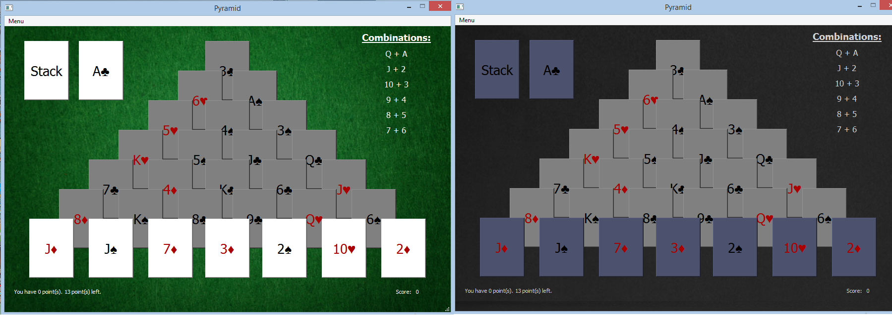

# PYRAMID

:exclamation: Play simple **card game**. Choose your game mode *(Dark or Light)*. But first read rules! They are in the Menu.

### :sparkle: Interface of the App

### :sparkle: Architecture

  There are two main classes, which used to describe the architecture of the program:
  * class **Cards** is responsible for the game behaviour;
  * class **Pyramid** is responsible for displaying the pyramid of cards.

### :sparkle: Structure of the Project

  There are two files:
  * **main.py** contains the main functional;
  * **mainwindow.py** implements UI.

:heavy_check_mark: I mastered:
* Python
* PyQt5
